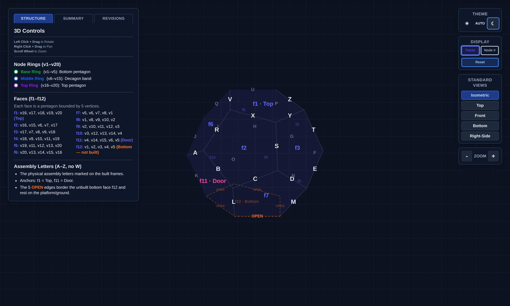
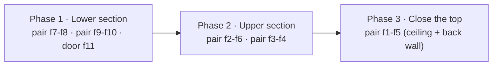
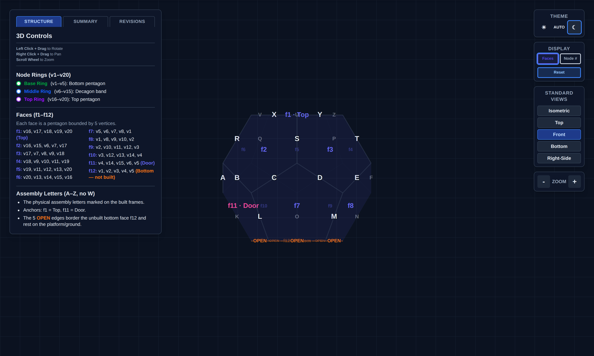

# NaoDec Build — Step 2: NaoDec Structure Set-Up

**Revision:** 1.1
**Date:** 2026-07-14
**Status:** 2.1 (panel build) is outlined pending materials; 2.2 (panel installation) is now specified per the author's decisions — hinged pairs, erection order, and the all-edges-hinged rule. Residual unknowns (door mechanism, hinge spec, bracing) are in Open Items.

> Rev 1.1 — §2.2 Panel Installation filled in per decisions 6+7 and 9 in
> [`NaoDec_Build_Pending_Decisions.md`](NaoDec_Build_Pending_Decisions.md): every lettered
> edge carries 2 hinges (ground edges none), panels pre-build into 5 hinged pairs + the
> door, erection runs lower section → upper section → ceiling pair. Face references
> aligned to the marking-guide renumbering (`Face N` = `fN`).
>
> Rev 1.0 — Initial outline (2.1 panel build; 2.2 was undefined).

[← Back to Build Work Instructions](NaoDec_Build_Work_Instructions.md) · Previous: [Step 1 — Base Platform Setup](NaoDec_Build_Step1_Base_Platform_Setup.md) · Next: [Step 3 — Vertex Units Installation](NaoDec_Build_Step3_Vertex_Units_Installation.md)

## Purpose

Step 2 builds and erects the NaoDec frame itself on top of the Step 1 platform: the 11 built pentagon panels of a regular dodecahedron, joined edge-to-edge by hinges.

## Quick Reference

| Fact | Value |
|---|---|
| Shape | Regular dodecahedron — 20 vertices, 30 edges, 12 pentagon faces |
| Faces built | 11 of 12 — `f12` (bottom) intentionally unbuilt as the entry opening |
| Panel construction | Wooden frame + stretched fabric |
| Panel grouping | **5 hinged pairs + 1 single panel (the door `f11`)** |
| Pair hinge joints | **M** (f7-f8) · **O** (f9-f10) · **R** (f2-f6) · **T** (f3-f4) · **U** (f1-f5) |
| Joint fastening | **2 hinges per lettered edge — all 25 joints (50 hinges)**; the 5 ground edges get none |
| Door face | `f11` |
| Top / ceiling face | `f1` |
| Dihedral angle | ≈ 116.57° between adjacent faces (regular dodecahedron) |
| Joint marking | Matching letters join (A–Z, no `W`) — 25 lettered joints, per the marking guides |
| Edges resting on the platform | 5 unlettered edges, on faces `f7`–`f11` |

*Assembly letters on the 30 edges, `f1 · Top`, `f11 · Door`, and the 5 dashed OPEN base edges. Snapshot of `NaoDec_3D_Structure_Framework_Rev1.0.html` (isometric, dark theme).*

## 2.1 Pentagon Panel

**Purpose:** build the 11 wooden-frame + stretched-fabric pentagon panels.

### 2.1.1 How to Build the Panel?

**Inputs needed (not yet specified):**
- Frame material and section size
- Corner joinery method (how the 5 frame members meet at each pentagon corner)
- Fabric type and how it's stretched/attached to the frame
- Fastener spec
- Finished pentagon edge length and per-panel weight

Whatever the build method, every panel needs its **assembly letters** transferred onto the frame at each edge, per `NaoDec_Face_Edge_Marking_Rev1.0.html` (or the interactive variant), and its **hinge halves fitted at 2 positions per lettered edge** (see 2.2.1) — ideally on the bench, not on the ladder.

#### 2.1.1.1 Side and Ceiling

The build method splits into **Side** and **Ceiling** variants:

- **Side** covers the 9 wall faces (`f2`–`f10` — lower ring `f7`–`f10` and upper ring `f2`–`f6` minus the door).
- **Ceiling** is `f1` — the top, opposite the unbuilt bottom.
- Not yet covered by this split: the **door** (`f11`), which needs to open or be removable — arguably a third build variant. Also not addressed: how the frame confirms the bottom (`f12`) stays unbuilt/open at the platform interface.

*(TBD — the actual build steps, materials, and what specifically differs between Side and Ceiling panels are pending the author's input.)*

## 2.2 Panel Installation

Reference geometry: [`NaoDec_3D_Structure_Framework_Rev1.0.html`](NaoDec_3D_Structure_Framework_Rev1.0.html) (or the [snapshots](images/build/) offline).

### 2.2.1 Hinged pairs — how panels attach

**Every lettered edge gets 2 hinges; matching letters join.** Only the 5 ground-resting edges have no hinges. The hinges are the panel-to-panel fastener — no separate bolts/clamps are specified. A hinge allows the pair to fold during handling; once the last panel closes the solid, the geometry itself locks every dihedral at ≈ 116.57° and the assembly becomes rigid.

Pre-build on the bench: **5 hinged pairs + 1 single panel (the door):**

| Pair | Faces | Hinge joint | Hinge edge (vertices) | Section |
|---|---|---|---|---|
| 1 | f7 + f8 | **M** | v1–v8 | Lower |
| 2 | f9 + f10 | **O** | v3–v12 | Lower |
| 3 | f2 + f6 | **R** | v15–v16 | Upper |
| 4 | f3 + f4 | **T** | v9–v18 | Upper |
| 5 | f1 + f5 | **U** | v19–v20 | Ceiling + back wall |
| — | f11 (Door) | single panel | — | Lower |

The five pairs + door cover all 11 built faces exactly once. Note `f5` is an upper-ring **wall**: pair 5 is "the ceiling and the wall it hinges to," not two ceiling panels.

The remaining 20 lettered joints are hinged **on site** during erection (2 hinges each, matching letters). Joint edges are crowded: 2 hinges + an internal LED strip (Step 4) + on joint **M** also speaker M (Step 5) + an external edge cover (Step 7) all share the same edge — see Open Items.

### 2.2.2 Erection sequence

1. **Lower section:** stand pair f7-f8, pair f9-f10, and the door f11 on their ground edges (per the landing map in 2.2.3) and hinge the adjacent lower joints (L, N, K — matching letters).
2. **Upper section:** lift pair f2-f6 and pair f3-f4 onto the lower ring; hinge every letter that meets (C, D, E, F, G, H, I, J, A, B, S).
3. **Close with pair f1-f5:** the last lift places the 5th upper wall (`f5`) and the ceiling (`f1`) together; hinge the remaining letters (P, Q, V, X, Y, Z). Closing this pair locks the whole solid rigid.

> ⚠ Until Phase 2 ties them together, the lower panels lean inward at ~116.57° and are **not self-supporting** — temporary bracing/props are required (spec TBD, see Open Items). The f1-f5 pair is the heaviest, highest lift; rigging method TBD.

*Front standard view — useful when checking letter positions phase by phase. Snapshot of `NaoDec_3D_Structure_Framework_Rev1.0.html`.*

### 2.2.3 Base placement & registration

The 5 unlettered ground edges land on the platform as:

| Ground edge | Belongs to face |
|---|---|
| v5–v1 | f7 |
| v1–v2 | f8 |
| v2–v3 | f9 |
| v3–v4 | f10 |
| v4–v5 | **f11 (Door)** |

- **The chair faces v1** (Step 6), and the controller unit sits outside, ~2–3 m from v1 (decision 1). The door edge (v4–v5) ends up **behind-left of the seated occupant**.
- **Mark the platform before erecting anything:** v1's corner position and the 5 ground-edge lines. One face of rotation error ruins every left/right instruction in Steps 3–9. Registration-mark method TBD.
- Which real-world direction v1 faces on site is an open item (index, Open Items #3).

## Cross-References

- [`NaoDec_Face_Edge_Marking_Rev1.0.html`](NaoDec_Face_Edge_Marking_Rev1.0.html) / [interactive](NaoDec_Face_Edge_Marking_Interactive_Rev1.0.html) — per-face letter diagrams
- [`NaoDec_3D_Structure_Framework_Rev1.0.html`](NaoDec_3D_Structure_Framework_Rev1.0.html) — 3D geometry with letters
- [`Paint_Comparison_Maxzo_RustTech_vs_JBP_SmartGlaze.md`](Paint_Comparison_Maxzo_RustTech_vs_JBP_SmartGlaze.md) — coating comparison, if panel frames get painted (still unplaced in the sequence)

## Safety

- **Unbraced lower ring:** five inward-leaning panels + a door panel are unstable until the upper ring closes — keep crew clear of fall lines, brace each phase.
- **Door egress:** the door is the occupant's only exit (the bottom opening sits under the riser). Whatever mechanism 2.2's open item settles on must be operable **from inside**.
- The erected frame stands over the occupant; no frame load rating exists yet (see Step 1 Safety for the platform side).

## Release Gate

| Gate | Required Result |
|---|---|
| 11 panels built | Frame + fabric complete, letters marked, hinge halves fitted per 2.2.1 |
| 5 pairs + door pre-built | Pair hinges (M, O, R, T, U) fold freely and seat at the dihedral |
| Base registered | Ground edges on the platform marks; v1 corner where planned |
| All 25 joints hinged | 2 hinges per joint, matching letters verified |
| Door | Operable from inside and outside (mechanism per Open Item #1) |
| Ground edges | Hinge-free, seated on the platform |

## Open Items

1. **Door mechanism** — with all four of its lettered edges hinged (A, B, K, L), how does `f11` open? Designate a swing edge + lift-off/removable-pin hinges on the other three, or make the whole panel removable. Affects Step 7 (covers on door edges) and egress.
2. **Hinge spec** — type, size, load rating, removable-pin or fixed, corrosion finish: TBD. 50 hinges + spares.
3. **Temporary bracing** for Phase 1/2 — props, clamps, crew count: TBD.
4. **Site orientation of v1** + platform registration-mark method (2.2.3).
5. **Hardware sharing the joint edges** — 2 hinges + internal LED strip + (joint M) speaker + external cover per edge; a per-edge layout that keeps them from colliding is TBD.
6. **Panel construction specifics** (2.1) — materials, joinery, fabric, fasteners, dimensions, weight.
7. **Side vs. Ceiling build differences** (2.1.1.1) — plus the door as a likely third variant.
8. **Painting/finishing** — the paint comparison doc exists but no step schedules painting.

---

[← Back to Build Work Instructions](NaoDec_Build_Work_Instructions.md) · Previous: [Step 1 — Base Platform Setup](NaoDec_Build_Step1_Base_Platform_Setup.md) · Next: [Step 3 — Vertex Units Installation](NaoDec_Build_Step3_Vertex_Units_Installation.md)
