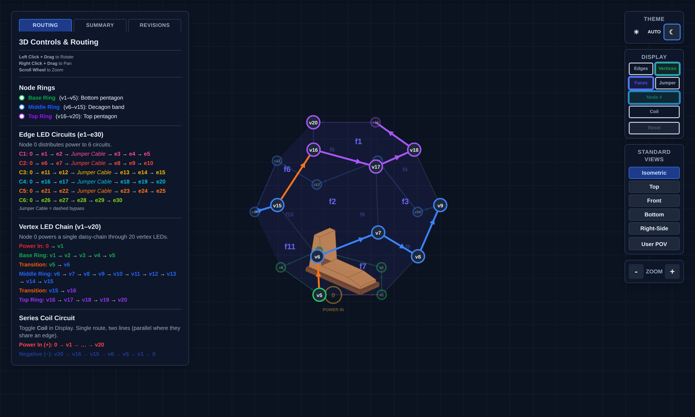
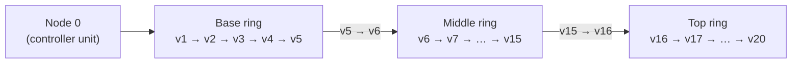
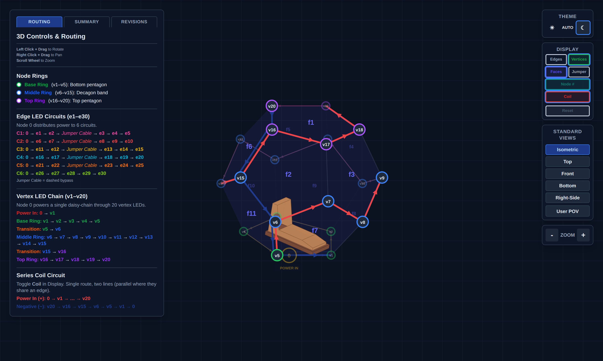

# NaoDec Build — Step 3: Vertex Units Installation (+ Series Coils)

**Revision:** 1.0
**Date:** 2026-07-14
**Status:** Drafted from the author's outline + decisions 1, 3, 9. Mounting method and some routing details TBD (see Open Items). The series-coil subsystem remains **pre-release (Rev 0)** — its numbers are provisional and it must not be powered outside its own qualification gates.

[← Back to Build Work Instructions](NaoDec_Build_Work_Instructions.md) · Previous: [Step 2 — Structure Set-Up](NaoDec_Build_Step2_Structure_Setup.md) · Next: [Step 4 — Internal Edge Units](NaoDec_Build_Step4_Internal_Edge_Units_Installation.md)

## Purpose

With all 11 panels up, install the 20 **vertex units** (LED channel CH1) in daisy-chain order, co-route the **series-coil loop** along the same path (decision 3), and bring both runs out at node 1 toward the controller unit.

## Quick Reference

| Item | Value | Source |
|---|---|---|
| Vertex units | **20 units × 3 LEDs = 60 × WS2815** | `NaoDec_WS2815_LED_Controller_Rev1.6.html` |
| Channel | CH1 · Master GPIO1 · WLED Out 1 | same |
| Chain path | **Node 0 → v1 → v2 → … → v20** (one daisy-chain) | `NaoDec_3D_Vertex_and_Edges_LED_Mapping_Rev1.3.html` |
| Cable run | ~20 m — the longest data run in the rig | README |
| Data cable | AWG18, **shielded twisted pair** advised; bench-verify the waveform | controller doc, Note 14 |
| Power | Isolated **12 V / 5 A rail** (PSU-B); 16 AWG branch (README says 18 — discrepancy already logged in `NaoDec_Power_and_Controller_Box_Report.md` §10) | power report |
| Optional injection | 2nd 12 V/5 A feed at **LED #31** (mid-chain), separate +12 V rails, common GND | controller doc, Note 17 |
| WS2815 backup line | HEAD pixel BI → GND; downstream BI ← previous DO | controller doc, Note 6 |
| Coils (pre-release) | 60 × 7-turn coils, 3 per vertex unit; **route with the vertex chain** | decision 3 · coil docs |

*The single CH1 daisy-chain: POWER IN (Node 0) → v1, base ring v1–v5, transition v5→v6, middle ring v6–v15, transition v15→v16, top ring v16–v20. Snapshot of `NaoDec_3D_Vertex_and_Edges_LED_Mapping_Rev1.3.html` (circuits hidden).*

## 3.1 Install the vertex units

1. Confirm Step 2's release gate passed (structure rigid, base registered — v1 is where the marks say it is).
2. Fit the 20 vertex units at v1…v20, **in chain order starting at v1** (data flows v1 → v20; WS2815 is fed at DI, arrows in the mapping page show direction).
3. Wire unit-to-unit exactly per the chain path — base ring first (floor level), then middle ring, then top ring (v16–v20 are overhead work inside the closed dome; do them before the floor fills up in Step 6).
4. Tie the **first pixel's BI to GND**; downstream each BI takes the previous pixel's DO (controller doc Note 6).
5. If the optional mid-chain power injection is adopted, land the second 12 V feed at LED #31 — that is an **additional run to node 1** to include in Step 8's inventory.

## 3.2 Series-coil co-routing (pre-release Rev 0)

Per decision 3, the 60-coil series loop (3 coils per vertex unit) routes **along the same path as the vertex chain**:

- Positive: Node 0 → v1 → … → v20 (with the chain).
- Return: v20 → v16 → v15 → v6 → v5 → v1 → Node 0 (per the mapping page's coil view).

*Coil loop co-routed with the vertex chain. Snapshot of `NaoDec_3D_Vertex_and_Edges_LED_Mapping_Rev1.3.html` (Coil display on).*

Non-negotiables from the coil docs (`NaoDec_Series_Coil_Build_Rev0_Pre-Release.html`, `NaoDec_Vertex_Series_Coil_Rev1.0.html`, CLAUDE.md):

- **Never run the string without the XL4015 CC/CV buck** (CV 11.0 V, CC 3.0 A). The cold loop is ~1.85 Ω — direct 12 V would attempt ~6.5 A / ~78 W.
- **Exact 3 A slow-blow fuse** at the buck input (not 3–5 A), local input decoupling, and a 70–80 °C thermal cutoff bonded to the hottest area.
- The coil branch keeps its **own isolated 12 V feed** — never tied to the LED V+ rails.
- Keep all runs and slack **uncoiled**; JST SM connectors with both pins paralleled.
- Subsystem is **pre-release**: it does not power up in Step 9 until its own qualification (see `XL4015_CC_CV_Mockup_Test_Procedure.md`) and the assembled-loop resistance measurement pass.

## 3.3 Routing and labeling to node 1

1. Dress both runs (CH1 data+power, coil pair, optional injection feed) down to the **v1 base corner** and out through the Step 1 pass-through (Step 1 Open Item #6) toward the controller unit ~2–3 m away.
2. Label every conductor at both ends (scheme TBD — see Open Items); leave service loops at node 1.
3. Do **not** land anything at the controller unit yet — that's Step 8.

## Safety

- No powered work: rails stay off/disconnected throughout Steps 3–7.
- Overhead work at v16–v20 inside the closed structure — ladder footing on the platform, don't load panel frames or fabric.
- The coil loop stays open-circuit (insulated ends) until Step 9's qualification.

## Release Gate

| Gate | Required Result |
|---|---|
| Chain order | 20 units wired v1 → v20, DI direction verified against the mapping page |
| Continuity/polarity | End-to-end continuity; +12 V/GND polarity checked at head, LED #31, and tail — before access gets harder |
| BI wiring | Head BI → GND confirmed |
| Coil loop | Routed with chain, ends insulated, **loop resistance measured and recorded** (expect ~1.85 Ω cold, per coil docs) |
| Labeling | Every run labeled both ends; service loops left at node 1 |
| Rails | No connection to any PSU yet; coil branch physically separate from LED wiring |

## Open Items

1. **Vertex-unit mounting method** at the frame corners — bracket/clip/strap: TBD.
2. **Injection run decision** — adopt the LED #31 mid-chain feed or not (affects Step 8 inventory).
3. **Labeling scheme + strain relief spec** at node 1 (shared with Steps 4–6; define once).
4. **Ceiling access** — v16–v20 are reachable only from inside once `f1-f5` closes; confirm ladder/scaffold approach that doesn't load the frames.

---

[← Back to Build Work Instructions](NaoDec_Build_Work_Instructions.md) · Previous: [Step 2 — Structure Set-Up](NaoDec_Build_Step2_Structure_Setup.md) · Next: [Step 4 — Internal Edge Units](NaoDec_Build_Step4_Internal_Edge_Units_Installation.md)
