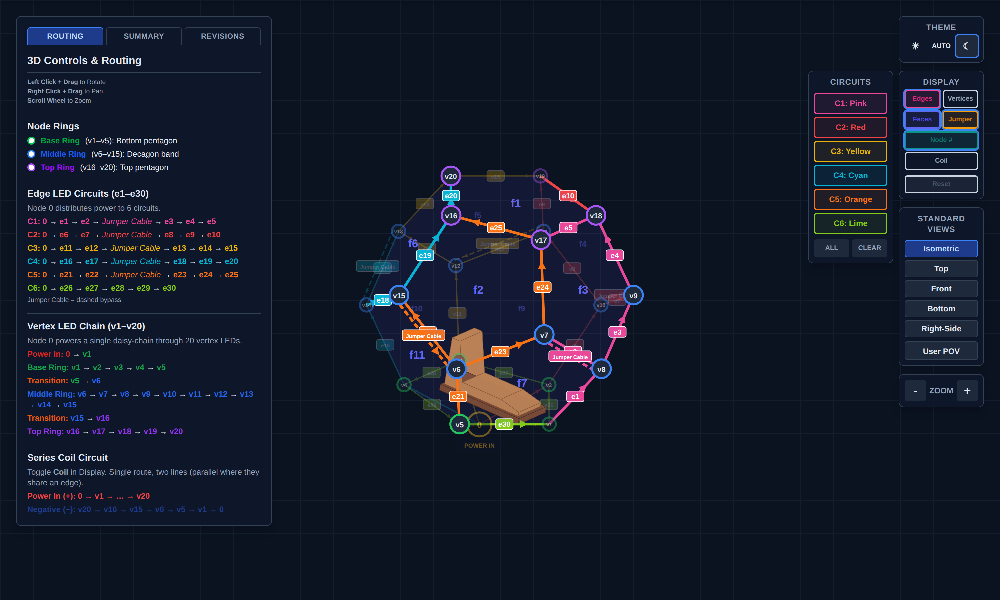
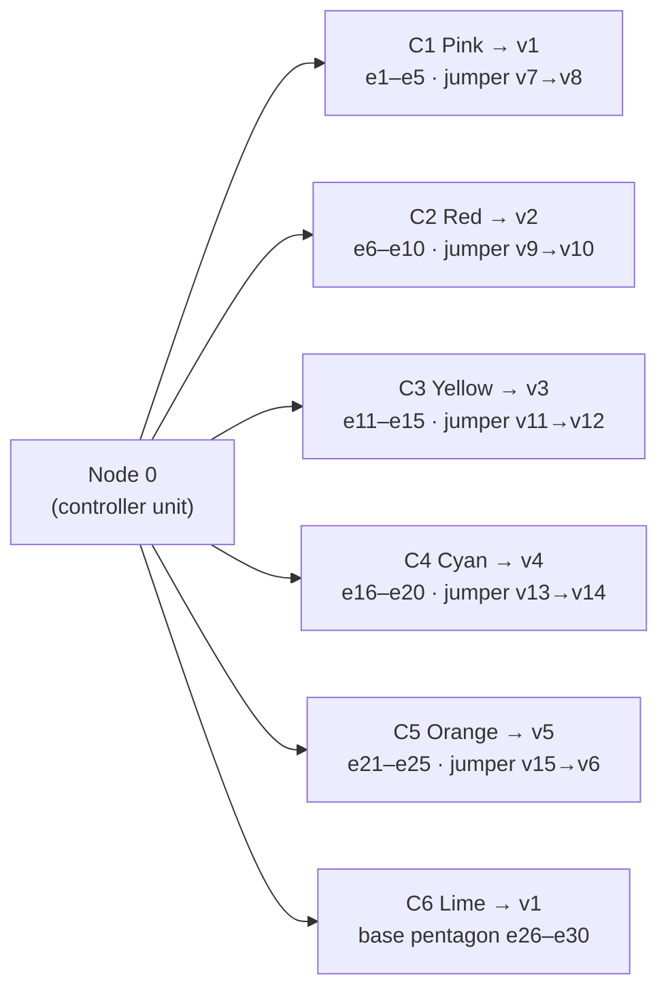

# NaoDec Build — Step 4: Internal Edge Units Installation

**Revision:** 1.0
**Date:** 2026-07-14
**Status:** Drafted from the author's outline + decision 9. Strip mounting method and the circuit-color ↔ channel-letter assignment are TBD (see Open Items).

[← Back to Build Work Instructions](NaoDec_Build_Work_Instructions.md) · Previous: [Step 3 — Vertex Units](NaoDec_Build_Step3_Vertex_Units_Installation.md) · Next: [Step 5 — Speaker Installation](NaoDec_Build_Step5_Speaker_Installation.md)

## Purpose

Install the six **internal edge LED circuits** (channels CH2–CH7, 280 px each) along the structure's 30 edges, and route every feed out at node 1. Strips run on the **inside** of the edges; the outside gets covers in Step 7.

## Quick Reference

| Item | Value | Source |
|---|---|---|
| Circuits | **C1–C6** (mapping-page colors) = CH2–CH7 = "Edge A–F" | mapping page · controller doc |
| LEDs | **280 × WS2815 per circuit** (~4.2 A max each) | controller doc |
| Feeds | fan out from Node 0: C1→v1 · C2→v2 · C3→v3 · C4→v4 · C5→v5 · C6→v1 | mapping page |
| Jumpers | one dashed **no-LED bypass** per circuit C1–C5 (C6 has none) | mapping page |
| Coverage | all 30 structural edges exactly once (~56 px/edge, derived) | mapping page |
| Data | AWG18 per channel, source-terminated 47 Ω at U2 | controller doc |
| Power | 12 AWG branch / 10 AWG trunk on the **12 V / 50 A rail** (PSU-C) | power report |
| ⚠ Rails | **Never tie the 5 V / 12 V 5 A / 12 V 50 A positive rails**; common GND mandatory | controller doc |

> **Naming caution:** the controller's circuit names "Edge A–F" are unrelated to the structural joint letters A–Z used everywhere else in these docs (see the index Terminology). On these pages the circuits are called **C1–C6** by color.

*C1–C6 with per-edge labels e1–e30 and dashed jumper cables. Snapshot of `NaoDec_3D_Vertex_and_Edges_LED_Mapping_Rev1.3.html` (vertex chain hidden, jumpers shown).*

## 4.1 Install the circuits

Work one circuit at a time, in path order (the mapping page's Routing tab lists every hop; arrows show data direction — WS2815 feeds at DI):

| Circuit | Feed | Strip run (vertices) | LED edges | Jumper |
|---|---|---|---|---|
| C1 Pink | v1 | v1→v8→v7 ⤸ v8→v9→v18→v17 | e1–e5 | v7→v8 |
| C2 Red | v2 | v2→v10→v9 ⤸ v10→v11→v19→v18 | e6–e10 | v9→v10 |
| C3 Yellow | v3 | v3→v12→v11 ⤸ v12→v13→v20→v19 | e11–e15 | v11→v12 |
| C4 Cyan | v4 | v4→v14→v13 ⤸ v14→v15→v16→v20 | e16–e20 | v13→v14 |
| C5 Orange | v5 | v5→v6→v15 ⤸ v6→v7→v17→v16 | e21–e25 | v15→v6 |
| C6 Lime | v1 | v1→v2→v3→v4→v5→v1 (base pentagon) | e26–e30 | — |

1. Mount the strip along each edge in the run order (mounting method TBD — Open Item #1). At joint edges, note the strip shares the edge with 2 hinges (+ speaker M on that joint, Step 5).
2. Fit each C1–C5 **jumper** as a plain bypass wire (no LEDs), dressed with the strip run.
3. Every circuit's head (DI end) gets its data + power pigtail routed to its feed vertex (v1–v5), then down to the ground edge nearest node 1.
4. C1–C5 each end high (top-ring edges) — those tails stay inside; only the heads go to node 1.

## 4.2 Routing to node 1

- All six feeds converge at the **v1 base corner** and exit through the Step 1 pass-through with the Step 3 runs.
- **Feed entry paths for C2–C5:** their feed vertices are v2–v5 — the runs from node 1 to those corners have to cross under (or along) the ground edges. Which ground edges they cross under, and how they're protected where the occupant walks, is TBD (Open Item #3).
- Label every head at both ends: `C1-PINK … C6-LIME` — the **C-color ↔ CH2–CH7 assignment happens at Step 8 landing** and gets recorded there (it is documented nowhere today — Open Item #2).

## Safety

- The 12 V / 50 A rail this step wires for can dump serious energy into a short — everything stays disconnected until Step 9.
- Ladder work on the upper/top edges; don't load frames or fabric.

## Release Gate

| Gate | Required Result |
|---|---|
| Coverage | All 30 edges carry strip per the table; jumpers fitted on C1–C5 |
| Continuity/polarity | Per-circuit DI-end to tail continuity; +12 V/GND polarity at each head — verified **before** Step 6 fills the floor |
| Rails | No V+ interconnection anywhere (measure between branch +12 V lines: open) |
| Labeling | Six heads labeled by color code at both ends |

## Open Items

1. **Strip mounting method** on the wooden frame edges (channel/clip/adhesive) — also determines how strips coexist with hinges on joint edges, and whether a strip crossing a hinge line blocks fold-flat teardown.
2. **C1–C6 ↔ CH2–CH7 ("Edge A–F") assignment** — undocumented; assign and record at Step 8.
3. **Feed entry paths for C2–C5** under/along the ground edges + walk-path protection (ties to Step 1 Open Items #6–7).
4. **Shared-edge ownership** — each edge belongs to two panels; which panel's frame carries the strip matters for teardown and repair. TBD.

---

[← Back to Build Work Instructions](NaoDec_Build_Work_Instructions.md) · Previous: [Step 3 — Vertex Units](NaoDec_Build_Step3_Vertex_Units_Installation.md) · Next: [Step 5 — Speaker Installation](NaoDec_Build_Step5_Speaker_Installation.md)
