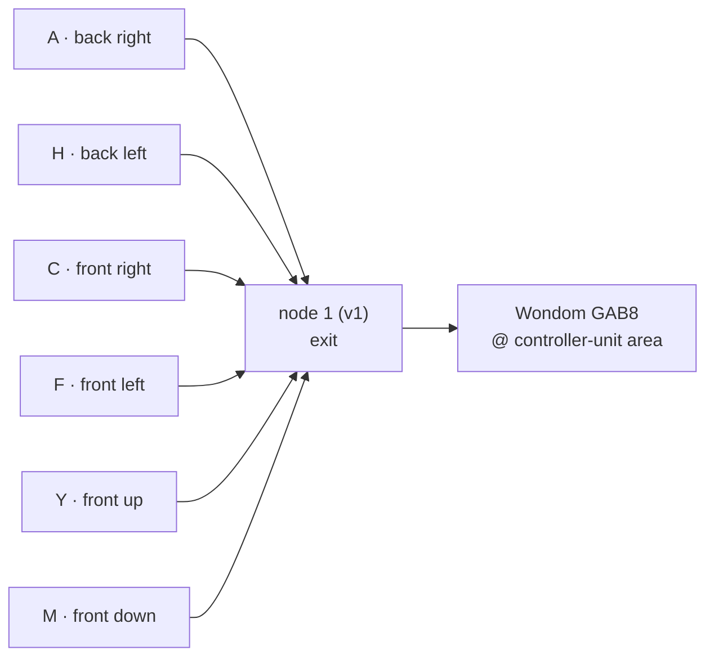

# NaoDec Build — Step 5: Speaker Installation

**Revision:** 1.0
**Date:** 2026-07-14
**Status:** Drafted from the author's outline + decisions 2 and 9. Speaker models and mounting hardware TBD (see Open Items). Speakers install **before** the move-in wave so the overhead work happens while the floor is still clear.

[← Back to Build Work Instructions](NaoDec_Build_Work_Instructions.md) · Previous: [Step 4 — Internal Edge Units](NaoDec_Build_Step4_Internal_Edge_Units_Installation.md) · Next: [Step 6 — Move-In](NaoDec_Build_Step6_Move_In.md)

## Purpose

Mount the six speakers on their assigned joint edges and route all six cable runs out at node 1, ready to land on the **Wondom GAB8** amplifier at the controller-unit area (Step 8).

## Quick Reference

Positions are the **seated occupant's frame** (chair faces v1 — see the index Orientation Reference). Letters are **structural joint letters**, not the LED "Edge A–F" circuit names.

| Speaker | Joint | Faces | Edge (vertices) | Position (occupant frame) |
|---|---|---|---|---|
| A | A | f6–f11 | v14–v15 | back right |
| H | H | f5–f9 | v11–v12 | back left |
| C | C | f2–f7 | v6–v7 | front right |
| F | F | f4–f8 | v9–v10 | front left |
| Y | Y | f1–f3 | v17–v18 | front up |
| M | M | f7–f8 | v1–v8 | front down |

Amplification (decision 2): all six land on the **Wondom GAB8** (10×50 W class-D, USB-C UAC2.0 audio from the Mac mini, 24 VDC supply — [manufacturer manual](https://files.sure-electronics.com/download/GAB8_10x50W_USB_Codec_Input_User_Manual.pdf)). Six of its channels are speakers; two more drive the chair transducer sets (Step 6).

## 5.1 Mounting

1. Verify each target edge by its **joint letter** on the frame (A, H, C, F, Y, M) against the table — don't trust memory of left/right, the frame letters are ground truth.
2. Fix each speaker to **frame members only — never to fabric** (fabric carries no load and will buzz).
3. Per-edge cautions:
   - **M (v1–v8):** this is hinged pair f7-f8's fold line, already carrying an LED strip — position the speaker so hinge, strip, and bracket don't collide (Step 2 Open Item #5).
   - **A (v14–v15):** one of its faces is the **door** (f11) — mount on the f6 side of the joint unless the door mechanism decision says otherwise, and confirm the door still operates.
   - **Y (v17–v18):** overhead work at the ceiling ring — do it now while the floor is empty; the mount is overhead of the occupant, so it must be positively fastened (no friction/adhesive-only fixing).
4. Aim/orientation toward the chair position (chair faces v1) — final aiming can wait for Step 9's audio checks.

## 5.2 Cabling

1. Run each speaker cable along frame members to the base, converge at the **v1 corner**, exit through the Step 1 pass-through.
2. Label both ends: `SPK-A`, `SPK-H`, `SPK-C`, `SPK-F`, `SPK-Y`, `SPK-M`.
3. Leave the GAB8 ends coiled at the controller-unit area — landing is Step 8.

## Safety

- Overhead mass (Y especially): mechanical fixing rated with margin; the occupant sits below.
- Ladder work inside the closed structure — same rules as Steps 3–4.
- The frame's own load budget is still unrated (Step 2 open) — six speakers add real mass; keep them at/near frame nodes where members meet.

## Release Gate

| Gate | Required Result |
|---|---|
| Placement | Six speakers on joints A, H, C, F, Y, M, verified against frame letters |
| Fixing | Frame members only; overhead unit Y positively fastened; door (joint A) still operates |
| Cabling | Six labeled runs to node 1, service loops left |
| Clearance | No contact between speaker/bracket and fabric, hinges, or LED strips |

## Open Items

1. **Speaker models + impedance** — GAB8 channels are rated at 4 Ω; confirm the chosen drivers match, and per-channel power vs. driver rating.
2. **GAB8 physical location** — assumed at the controller-unit table (USB-C must reach the Mac mini beside the unit); confirm, and whether it mounts inside the unit or on the table. Its **24 VDC supply** is a new PSU not in any power doc (recorded in Step 8).
3. **Mounting hardware** per speaker (bracket type, fastener spec): TBD.
4. **Verify positions once v1's site orientation is fixed** — the occupant-frame labels in the table were the author's intent; re-check each against the letters after Step 2 registration (index Open Item #3).
5. **Cable spec** (gauge/length per run for ~2–3 m outside + interior height runs): TBD.

---

[← Back to Build Work Instructions](NaoDec_Build_Work_Instructions.md) · Previous: [Step 4 — Internal Edge Units](NaoDec_Build_Step4_Internal_Edge_Units_Installation.md) · Next: [Step 6 — Move-In](NaoDec_Build_Step6_Move_In.md)
