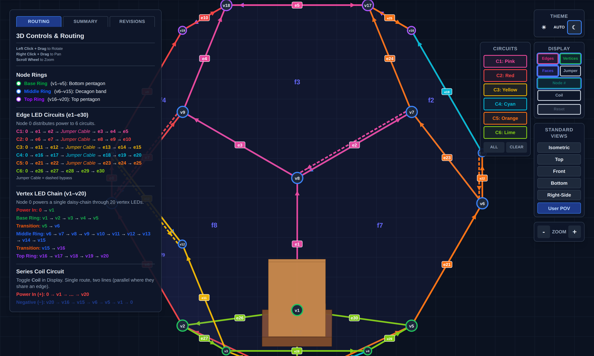
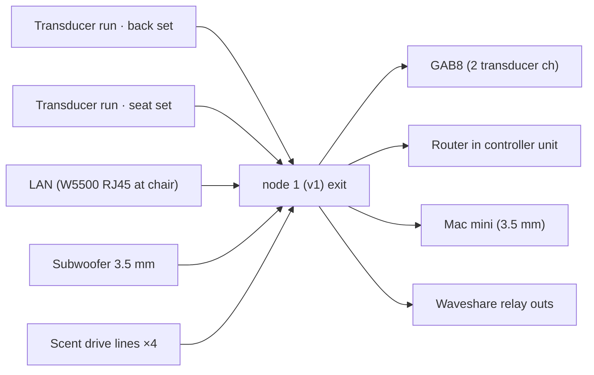

# NaoDec Build — Step 6: Move-In — Scent · Subwoofer · Chair

**Revision:** 1.0
**Date:** 2026-07-14
**Status:** Drafted from the author's outline + decisions 1, 2, 4, 5, 9. Equipment models and mains routing TBD (see Open Items).

[← Back to Build Work Instructions](NaoDec_Build_Work_Instructions.md) · Previous: [Step 5 — Speaker Installation](NaoDec_Build_Step5_Speaker_Installation.md) · Next: [Step 7 — Edge Covers](NaoDec_Build_Step7_Edge_Covers.md)

## Purpose

One move-in wave (decision 9④): bring the **scent atomizer unit**, the **subwoofer**, and the **chair** in through the door, position the chair on its footing guide, then route all their cables out at node 1.

## Quick Reference

| Item | Placement | Signal/drive | Power |
|---|---|---|---|
| Scent atomizer/mist unit | beside the subwoofer | 4 drive lines from the Waveshare relay board **in the controller unit** (decision 4) | via drive lines (12 V atomizer branch) |
| Subwoofer | on the platform, **left of the chair** | **3.5 mm jack direct from the Mac mini** (decision 2) | own mains — **inside the structure** (flag) |
| Chair | center, **facing v1**, legs in the Step 1.3 position locks | — | — |
| 4× transducers in the chair | **back set** (upper back + lower back) · **seat set** (left seat + right seat) | 2 × GAB8 channels (decision 2) | via GAB8 |
| Media playback controller | under the **right armrest** | LAN: router (in the controller unit) → node 1 → chair → **W5500 RJ45** | local **5 V/2 A USB adapter** — mains at the chair (flag) |

*Inside view with the chair prop — the chair faces v1 (bottom center). Snapshot of `NaoDec_3D_Vertex_and_Edges_LED_Mapping_Rev1.3.html` (User POV).*

## 6.1 Scent atomizer unit in

1. Carry the atomizer/mist unit (4 × JY-M27AO discs per `NaoDec_Scent_Controller_Schematic_Rev2.0.html`) through the door; stage it at the subwoofer position (left of chair) — final placement after the sub is in.
2. The **Waveshare board does not move in** — it stays in the controller unit (decision 4); only mist hardware and its drive lines are inside.
3. Mind drip/condensation orientation: mist outlet away from the media controller, LED strips, and fabric (see Safety).

## 6.2 Subwoofer in

1. Carry in through the door **over the base-edge LED strips** — lay protection over the strips on the carry path first (e26–e30 are freshly installed).
2. Place on the platform, left of the chair position, clear of the door's swing/egress path.
3. Its 3.5 mm line runs to the **Mac mini** (outside, on the table next to the controller unit); its mains lead is an **inside-the-structure power run** — routing TBD (Open Item #3).

## 6.3 Chair in + positioning

1. Confirm door aperture vs. chair dimensions **before lifting** (unverified — Open Item #1).
2. Carry in over the protected base edges; set the legs into the **Step 1.3 footing-guide locks**; engage the locks. The chair faces **v1**.
3. Transducers — fit before or after carry-in per what access allows (author's call): **back set** at upper + lower back, **seat set** at left + right seat. Each set wires as one GAB8 channel pair run (2 runs total).
4. Mount the **media playback controller** under the right armrest with its switches and volume control reachable by the seated occupant. Its ESP32 lives in this enclosure by design — moved out of the controller unit because panel signal wires don't tolerate length (see the Placement Requirement in `NaoDec_Media_Playback_Controller_Build_and_Max_Setup.md` §1). Keep its panel runs ≤ 0.5 m per that doc.
5. Plug the W5500's RJ45 with the LAN run (next section); the controller's 5 V/2 A USB adapter needs **mains at the chair** (Open Item #3).

## 6.4 Route all cables to node 1

1. Dress every run to the v1 corner and out the pass-through: `XDCR-BACK`, `XDCR-SEAT`, `LAN-CHAIR`, `SUB-3.5`, `SCENT-1…4`. Label both ends.
2. Keep the floor runs out of the door→chair walk path, or under ramped protection (Step 1 Open Item #7).
3. Landing happens in Step 8 (GAB8, router, Waveshare, Mac mini).

## Safety

- **De-energized work:** Steps 3–5 wiring is all in place around you — nothing is connected to a PSU yet, and it stays that way until Step 9.
- **Platform load** — chair + occupant + subwoofer now sit on a stack whose load rating is still unspecified (Step 1 Safety). The gate below inherits that requirement.
- **Egress** — subwoofer + scent unit sit between the occupant and the door quadrant; keep a clear walk path.
- **Mist near electronics** — atomizer output must not condense onto the media controller, strips, or connectors; fragrance dosing limits for an enclosed occupant are unassessed (Open Item #5).

## Release Gate

| Gate | Required Result |
|---|---|
| Chair | Legs locked in the footing guides; no shift under test load; facing v1 |
| Transducers | Both sets secured in the chair, runs labeled |
| Media controller | Mounted under right armrest; panel runs ≤ 0.5 m; RJ45 connected |
| Subwoofer + scent unit | Placed left of chair, secured, clear of egress |
| Cables | All runs labeled and at node 1 with service loops; walk path protected |
| Base-edge LEDs | Undamaged after carry-ins (re-run the Step 4 continuity spot-check) |

## Open Items

1. **Door aperture vs. chair dimensions** — unverified; measure both before move-in day.
2. **Transducer models/impedance** vs. GAB8 channel rating; per-set series/parallel wiring plan.
3. **Mains inside the structure** — subwoofer mains + chair USB adapter: source, routing, and protection are unspecified (ties into index Open Item #4).
4. **Scent drive-line spec** — length/gauge for controller unit → node 1 → atomizer unit (~2–3 m + interior run) vs. the schematic's fusing.
5. **Humidity/condensation + fragrance exposure** for a person in an enclosed volume — nothing in the repo addresses either.
6. **Carry-in order within the wave** (sub → scent → chair vs. chair last confirmed) and whether transducers fit before or after the chair enters.

---

[← Back to Build Work Instructions](NaoDec_Build_Work_Instructions.md) · Previous: [Step 5 — Speaker Installation](NaoDec_Build_Step5_Speaker_Installation.md) · Next: [Step 7 — Edge Covers](NaoDec_Build_Step7_Edge_Covers.md)
