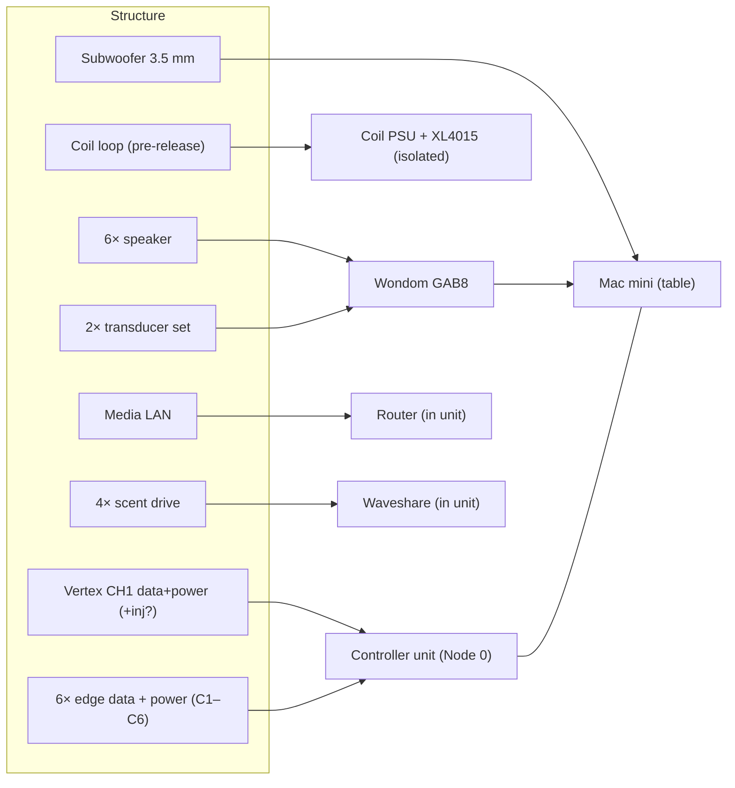

# NaoDec Build — Step 8: Controller Unit Hookup

**Revision:** 1.0
**Date:** 2026-07-14
**Status:** Drafted from the author's outline + decisions 1, 2, 4, 5. The controller unit's own internal build is not a step here (see Open Items); this step lands the field cables into it.

[← Back to Build Work Instructions](NaoDec_Build_Work_Instructions.md) · Previous: [Step 7 — Edge Covers](NaoDec_Build_Step7_Edge_Covers.md) · Next: [Step 9 — Commissioning & Test](NaoDec_Build_Step9_Commissioning_and_Test.md)

## Purpose

Land every run that came out at node 1 into the **controller unit** (= Node 0, sitting outside the structure ~2–3 m from node 1), plus the Mac mini and GAB8 on the adjacent table. Verify each landing against the channel map.

## Quick Reference — unit contents

Decision 5 vs. the source docs, with each discrepancy flagged:

| In the controller unit | Notes | Flag |
|---|---|---|
| LED **Master** — ESP32-S3-WROOM-1 | WLED, CH1–CH4 | — |
| LED **Slave** — ESP32-S3-WROOM-1 | WLED DDP, CH5–CH7 | — |
| **Waveshare** ESP32-S3-Relay-6CH | scent controller, 4× JY-M27AO drive | — (this **is** the 3rd ESP32, not a 4th board) → OI #1 |
| **Router** — ASUS RT-AX1800HP | LAN to chair (W5500) + Mac mini | docs place it "in a metal ATX case" with the Mac mini → OI #2 |
| PSUs | Config 1: PSU-A 5V/3A · PSU-B 12V/5A · PSU-C 12V/50A · PSU-D 12V/5A scent — **or** Config 2: single 1000 W ATX | Config choice unresolved → OI #3 |
| **GAB8 24 VDC supply** | new — powers the amplifier; not in any existing power doc | → OI #4 |

**Not in the unit:**
- **Mac mini** — on the **table beside** the unit (decision 5); WLED/Art-Net to the LED Master over USB-C→UART, Max/MSP media player, static `192.168.50.2`.
- **Wondom GAB8 amplifier** — at the table/unit area (USB-C from the Mac mini); exact mounting is OI #4.
- **Media playback controller** — at the chair (Step 6), not here.
- **Series-coil PSU + XL4015 buck** — the coil subsystem's own isolated 12 V source, kept separate (Step 3).

> **Node 0 = this unit.** The mapping page still draws Node 0 under the base center (the original under-platform plan); the current build has it outside, ~2–3 m from node 1. A future annotation on `NaoDec_3D_Vertex_and_Edges_LED_Mapping_Rev1.3.html` should note this (index Open Item).

## 8.1 Cable landing inventory

Everything that converges at node 1 and where it lands:

| # | Run(s) | Lands on | Rail / notes |
|---|---|---|---|
| 1 | Vertex CH1 data | LED Master GPIO1 → U2 → strip DI | via 47 Ω term |
| 2 | Vertex CH1 power (+ optional injection at LED #31) | PSU-B 12 V/5 A | isolated vertex rail |
| 3 | 6× edge data (C1–C6) | Master GPIO4/5/6 (CH2–4) + Slave GPIO4/5/6 (CH5–7) | **assign & record C-color ↔ channel here** (OI #5) |
| 4 | Edge power branches → trunk | PSU-C 12 V/50 A | 12 AWG branch / 10 AWG trunk |
| 5 | Coil loop (+/−) | Coil XL4015 output (isolated PSU) | **not** a unit rail; pre-release |
| 6 | 2× transducer set | GAB8 (2 channels) | 24 VDC amp |
| 7 | 6× speaker | GAB8 (6 channels) | 24 VDC amp |
| 8 | Media LAN | Router LAN port | DHCP-reserved `192.168.50.114` |
| 9 | Subwoofer 3.5 mm | **Mac mini** headphone/line out | not the unit |
| 10 | 4× scent drive | Waveshare relay outputs | PSU-B or PSU-D (12 V scent branch) |
| — | Common GND | all PSU negatives bonded | **mandatory** |

## 8.2 Land and verify

1. Build/confirm the controller unit exists and its Config (1 vs 2) is decided **before** landing (OI #3).
2. Land per the table, one subsystem at a time; keep the **three V+ rails isolated** (5 V, 12 V/5 A, 12 V/50 A) and the coil rail separate — never bridge V+.
3. **Assign and record the C1–C6 ↔ CH2–CH7 map** (undocumented today, Step 4 OI #2): note which colored circuit is on which GPIO/strip, both in the unit and back-annotated to the docs.
4. Bond all PSU negatives to the common ground bus (controller doc Note 1).
5. Land the Mac mini USB-C→UART to the Master and the GAB8 USB-C to the Mac mini; sub 3.5 mm to the Mac mini out.

## Safety

- **Never tie the three LED V+ rails, nor the coil rail** — isolated throughout; common GND only.
- Lockout: keep the upstream mains/PSUs off during landing.
- The 12 V/50 A rail can deliver fault currents that start fires — verify no short before Step 9 powers it.

## Release Gate

| Gate | Required Result |
|---|---|
| Inventory | Every run in 8.1 landed and labeled at both ends |
| Rails | V+ isolation measured (open between rails); common GND continuous |
| Mapping | C1–C6 ↔ CH2–CH7 recorded |
| Unit | Controller unit closed/serviceable; Mac mini + GAB8 sited on the table |
| No power | Still de-energized — power-up is Step 9 |

## Open Items

1. **Waveshare count** — the unit has **3 ESP32-class boards total** (Master, Slave, Waveshare); the outline's "3× ESP32 + 1× Waveshare" reads as 4. Confirmed here as 3.
2. **Router placement** — decision 5 puts it in the unit; the media docs describe it with the Mac mini "in a metal ATX case" ~6 m from the chair. The unit sits ~2–3 m from node 1 — reconcile the distances and the W2 Cat6 length (media doc calls it ~6 m).
3. **Controller unit build is not a step** — Config 1 (DIN enclosure) vs Config 2 (ATX case) unresolved; it must be bench-built before this step.
4. **GAB8 supply + mounting** — a new 24 VDC PSU and the amp's location (in the unit or on the table) aren't in any power doc.
5. **C1–C6 ↔ CH2–CH7 assignment** — pick and record it here (see Step 4).
6. **Mains distribution** — the unit, Mac mini, GAB8 (24 V), subwoofer, and chair USB adapter all need mains; no single mains/CB plan exists.

---

[← Back to Build Work Instructions](NaoDec_Build_Work_Instructions.md) · Previous: [Step 7 — Edge Covers](NaoDec_Build_Step7_Edge_Covers.md) · Next: [Step 9 — Commissioning & Test](NaoDec_Build_Step9_Commissioning_and_Test.md)
