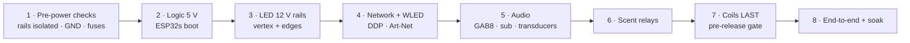

# NaoDec Build — Step 9: Commissioning & Test

**Revision:** 1.0
**Date:** 2026-07-14
**Status:** Drafted from decision 8. This is the first power-up: it references the existing subsystem test procedures rather than restating them. Acceptance thresholds for audio/haptics and the occupant-safety sign-off are still owed (see Open Items).

[← Back to Build Work Instructions](NaoDec_Build_Work_Instructions.md) · Previous: [Step 8 — Controller Unit Hookup](NaoDec_Build_Step8_Controller_Unit_Hookup.md)

## Purpose

Bring the fully wired installation to life in a controlled order, verify every subsystem, and run an end-to-end show before it carries an occupant.

## Quick Reference — power-up order

## 9.1 Pre-power checks (de-energized)

Confirm, before any PSU is switched on (cite `NaoDec_WS2815_LED_Controller_Rev1.6.html` engineering notes):
- The three LED V+ rails isolated from each other; coil rail separate; common GND continuous.
- All inline fuses fitted (F1 vertex branch, FB1 edge block, scent F_MAIN, coil exact-3 A).
- No short on any rail to GND.

## 9.2 Power-up order

1. **Logic 5 V (PSU-A)** — the 3 ESP32s boot; check 3V3 rails, no brownout.
2. **LED 12 V rails (PSU-B vertex, PSU-C edges)** — bring up one at a time; watch inrush (NTC1 on the 50 A rail).
3. **GAB8 24 V — muted** until audio checks; keep gain down.
4. **Coils — last, and only via their gate** (§9.8).

## 9.3 Network

Per `NaoDec_Media_Playback_Controller_Build_and_Max_Setup.md` §8:
- Router up; DHCP reservations: Mac mini static `192.168.50.2`, LED boards `.111`–`.113`, media controller `.114`.
- Confirm the media controller leases `.114` within ~15 s of link (its acceptance test NET-01).

## 9.4 WLED / lighting

- Master WLED outputs CH1–CH4; Slave receives DDP and outputs CH5–CH7.
- Mac mini streams WLED/Art-Net over USB-C→UART to the Master.
- Verify each channel lights its intended strips; **bench-verify the CH1 vertex waveform** (20 m run, controller Note 14) before trusting it.
- Record the confirmed **C1–C6 ↔ CH2–CH7** mapping from Step 8 against what actually lights.

## 9.5 Media controller

Run the controller's own acceptance suite as-is — `NaoDec_Media_Playback_Controller_Build_and_Max_Setup.md` §11 (ELEC, NET, FUNC, SYS tests: play/pause/stop one-shot, volume ramp, no-command-on-boot, reconnect, 8 h soak).

## 9.6 Audio

- GAB8 enumerates as a USB audio device on the Mac mini (macOS, no driver).
- Per-channel check: each of the 6 **speakers** (A, H, C, F, Y, M) sounds on its own channel and in the right occupant-frame position; fix any swap now.
- **Transducer sets** (back, seat) drive from their 2 channels — feel, not just level.
- **Subwoofer** plays from the Mac mini 3.5 mm line.

## 9.7 Scent

- Per `firmware/Scent_controller/README.md`: exercise each of the 4 relays/atomizers (web UI / UDP / serial command), confirm mist output and no drip onto electronics.

## 9.8 Coils (pre-release gate — do this last, cautiously)

- **Do not energize** until the XL4015 is qualified per the mockup procedure (`XL4015_CC_CV_Mockup_Test_Procedure.md`, referenced by the coil docs [`NaoDec_Series_Coil_Build_Rev0_Pre-Release.html`](NaoDec_Series_Coil_Build_Rev0_Pre-Release.html) / [`NaoDec_Vertex_Series_Coil_Rev1.0.html`](NaoDec_Vertex_Series_Coil_Rev1.0.html)) **and** the assembled-loop resistance is measured against the ~1.85 Ω estimate.
- Set CV 11.0 V, CC 3.0 A on the bench first; exact-3 A fuse in; thermal cutoff bonded.
- Only then bring the loop up through the buck; watch the TCO and connector temperatures.
- This subsystem stays **pre-release** — commissioning it is a gated experiment, not a routine power-up.

## 9.9 End-to-end & soak

- Run a full show cue (light + sound + haptics + scent together) from the Mac mini / media controller.
- Soak (8 h target, per the media SYS-02 pattern) with no unintended commands, no thermal creep, no scent drip.
- Complete the commissioning record below.

## Commissioning Record

| Field | Value |
|---|---|
| Date / commissioned by | |
| Rail isolation + GND verified | |
| C1–C6 ↔ CH2–CH7 map confirmed | |
| WLED master/slave + Art-Net OK | |
| Media controller suite (§11) pass | |
| Audio: 6 speakers + 2 transducer sets + sub | |
| Scent: 4 atomizers | |
| Coils: qualified + loop resistance | (pre-release) |
| End-to-end show + soak | |
| Open issues | |

## Release Gate

| Gate | Required Result |
|---|---|
| Pre-power | Rails isolated, fuses in, no shorts |
| Lighting | All 7 channels correct; CH1 waveform verified |
| Network + media | Reservations held; media suite passes |
| Audio | All speakers/transducers/sub correct and positioned |
| Scent | All atomizers fire; no drip |
| Coils | Pre-release gate passed or subsystem left un-powered by decision |
| Occupant safety | Signed off (see Open Items) before anyone sits inside |

## Open Items

1. **Acceptance thresholds** for audio level/positioning and haptic intensity — none defined.
2. **Occupant-safety sign-off** — who authorizes a person inside (platform load rating, egress, ventilation, mains-inside, fabric-near-strips — all still open across Steps 1, 2, 6 and the index). Step 9 must not pass until that owner signs.
3. **Coil commissioning** stays pre-release — decide per build whether it's energized at all in this revision.

---

[← Back to Build Work Instructions](NaoDec_Build_Work_Instructions.md) · Previous: [Step 8 — Controller Unit Hookup](NaoDec_Build_Step8_Controller_Unit_Hookup.md)
