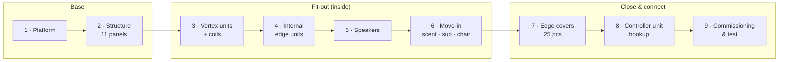

# NaoDec — Full Build Work Instructions

**Revision:** 1.1
**Date:** 2026-07-14
**Status:** Steps 1–9 drafted from the author's full outline and the recorded decisions in [`NaoDec_Build_Pending_Decisions.md`](NaoDec_Build_Pending_Decisions.md). Hardware specifics still marked TBD are flagged per step; the sequence-level gaps live in this file's Open Items.

> Rev 1.1 — Full 9-step sequence per the author's outline + clarified installation order
> (decision 9): speakers install before the move-in wave, scent/subwoofer/chair move in
> together, edge covers added as their own step, commissioning added as Step 9. Added the
> Orientation Reference and Terminology sections all step docs rely on.
>
> Rev 1.0 — Initial skeleton: index + Steps 1–2.

This is the top-level index for building the physical NaoDec installation. It sequences the build and links one document per step; wiring/schematic detail stays in the other `NaoDec_*` docs, which each step cites.

## How to Use This Document

- Each numbered **step** is a separate Markdown file, linked from the table. Sub-steps are sections inside that step's file.
- Work through steps in order. Each step file ends with a **Release Gate** — don't start the next step until the current one's gate passes.
- Gaps flagged **(TBD)** or listed under Open Items are decisions still owed; per-step Open Items are canonical, this file lists only sequence-level items.

## Build Sequence

| Step | Title | Doc |
|---|---|---|
| 1 | Base Platform Setup | [`NaoDec_Build_Step1_Base_Platform_Setup.md`](NaoDec_Build_Step1_Base_Platform_Setup.md) |
| 2 | NaoDec Structure Set-Up (11 pentagon panels) | [`NaoDec_Build_Step2_Structure_Setup.md`](NaoDec_Build_Step2_Structure_Setup.md) |
| 3 | Vertex Units Installation (+ series coils) | [`NaoDec_Build_Step3_Vertex_Units_Installation.md`](NaoDec_Build_Step3_Vertex_Units_Installation.md) |
| 4 | Internal Edge Units Installation | [`NaoDec_Build_Step4_Internal_Edge_Units_Installation.md`](NaoDec_Build_Step4_Internal_Edge_Units_Installation.md) |
| 5 | Speaker Installation | [`NaoDec_Build_Step5_Speaker_Installation.md`](NaoDec_Build_Step5_Speaker_Installation.md) |
| 6 | Move-In: Scent · Subwoofer · Chair | [`NaoDec_Build_Step6_Move_In.md`](NaoDec_Build_Step6_Move_In.md) |
| 7 | Edge Covers (25 pcs) | [`NaoDec_Build_Step7_Edge_Covers.md`](NaoDec_Build_Step7_Edge_Covers.md) |
| 8 | Controller Unit Hookup | [`NaoDec_Build_Step8_Controller_Unit_Hookup.md`](NaoDec_Build_Step8_Controller_Unit_Hookup.md) |
| 9 | Commissioning & Test | [`NaoDec_Build_Step9_Commissioning_and_Test.md`](NaoDec_Build_Step9_Commissioning_and_Test.md) |

## Orientation Reference

All **front / back / left / right / up / down** words in the step docs are from the **seated occupant's point of view**: the chair faces **node 1 (v1)** (per `NaoDec_3D_Vertex_and_Edges_LED_Mapping_Rev1.3.html`, which models the recliner facing v1). The geometry docs define no compass "front" of their own.

- The door (`f11`, base edge v4–v5) ends up **behind-left** of the seated occupant.
- Which real-world direction v1 faces **on site** is not fixed anywhere yet — see Open Items. Until it is, mark v1's base corner on the platform before erecting anything (Step 2 §2.2.3).

## Terminology

| Term | Meaning |
|---|---|
| **node 1 (v1)** | The base-ring vertex the chair faces; nearest structure corner to the controller unit. Start of the vertex chain, circuits C1/C6, and the coil positive. |
| **Node 0 = the controller unit** | The docs' "Node 0 · POWER IN" bus point **is** the controller unit (decision 1). Originally planned under the platform — which is how `NaoDec_3D_Vertex_and_Edges_LED_Mapping_Rev1.3.html` still draws it — the current build places it **outside the structure, ~2–3 m from node 1**, with the operator station and Mac mini alongside. The mapping page needs a future annotation for this (open item). |
| **Joint letters A–Z (no W)** | The 25 physical assembly letters on the panel frames (marking guides). **Not** the same thing as… |
| **"Edge A–F"** | …the LED controller's names for the 6 edge circuits (CH2–CH7) in `NaoDec_WS2815_LED_Controller_Rev1.6.html`. Letter overlap is coincidental: speaker edge "A" (joint f6-f11) has nothing to do with LED circuit "Edge A" (CH2). |
| **f1–f12 / v1–v20** | Framework face and vertex ids. Marking-guide face numbers equal f-ids (Face 1 = f1 = Top, Face 11 = f11 = Door). |

## Open Items (sequence-level)

Per-step items live in each step doc. These are the cross-cutting ones:

1. **Door mechanism** — every lettered edge is hinged (decision 6+7), which leaves the door `f11` hinged on all four sides; how it opens (swing side + lift-off pins, or fully removable) is undecided. → Step 2.
2. **Controller unit build is not a step** — Step 8 lands cables into a unit nothing builds; Config 1 (DIN enclosure) vs Config 2 (ATX case) in `NaoDec_Controller_Box_Configs_Rev1.1.html` is unresolved. Bench-build it in parallel; it must exist before Step 8.
3. **Site orientation of v1** — nothing fixes which way the chair/v1 axis points in the room; every left/right instruction depends on it. → Step 2 §2.2.3.
4. **Occupant environment** — ventilation for a person inside 11 closed fabric faces, egress past subwoofer/scent/floor cables through a door behind-left, mains power runs inside the structure (subwoofer, chair USB adapter), fabric near warm LED strips: none assessed yet.
5. **Teardown/storage step** — the letter-marking system and hinged pairs imply repeat assembly/teardown, but no teardown doc exists; edge covers and strips fixed across hinge lines could silently make fold-flat teardown impossible. → affects Steps 2, 3, 4, 7.
6. **Published site index doesn't list the build MDs** — `.github/workflows/update-index.yml` indexes `*.html` plus one hard-coded MD; these build docs are reachable from `README.md` only. Extend the workflow if they should appear on https://surasaknie.github.io/naodec/.
7. **The two 3D pages need internet on site** — `NaoDec_3D_Structure_Framework_Rev1.0.html` and `NaoDec_3D_Vertex_and_Edges_LED_Mapping_Rev1.3.html` load Tailwind from `cdn.tailwindcss.com`, so they don't render fully offline. The snapshots in [`images/build/`](images/build/) are the offline fallback for crews.

## References

- [`NaoDec_Build_Pending_Decisions.md`](NaoDec_Build_Pending_Decisions.md) — the 10 recorded build decisions these docs implement
- [`README.md`](README.md) — hardware/subsystem overview
- [`NaoDec_3D_Structure_Framework_Rev1.0.html`](NaoDec_3D_Structure_Framework_Rev1.0.html) — vertex/edge/face geometry + assembly letters
- [`NaoDec_Face_Edge_Marking_Rev1.0.html`](NaoDec_Face_Edge_Marking_Rev1.0.html) / [interactive variant](NaoDec_Face_Edge_Marking_Interactive_Rev1.0.html) — per-face joint-letter diagrams
- [`NaoDec_3D_Vertex_and_Edges_LED_Mapping_Rev1.3.html`](NaoDec_3D_Vertex_and_Edges_LED_Mapping_Rev1.3.html) — LED routing model (vertex chain, circuits C1–C6, coil loop)
