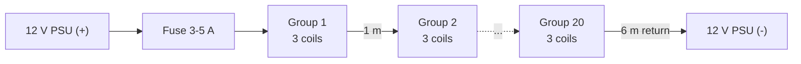

# NaoDec

Interactive wiring and schematics for a 7-channel WS2815 LED installation driven by dual ESP32-S3 controllers running WLED.

Published at https://surasaknie.github.io/naodec/ (auto-indexed).

---

## Overview

NaoDec is a browser-based documentation set for a large-scale addressable LED rig. All files are self-contained HTML — no build step, no dependencies. Open any file locally or browse the auto-indexed GitHub Pages site.

The design uses two ESP32-S3-WROOM-1 N16R8 modules running WLED in a master/slave DDP configuration to drive 1,740 WS2815 (12 V) pixels across 7 independent channels, with a SN74AHCT245N octal transceiver for 3.3 V → 5 V logic conversion.

---

## Repository

```
naodec/
├── index.html                                     # GitHub Pages auto-index
├── NaoDec_WS2815_LED_Controller_Rev1.6.html       # Full controller schematic (interactive)
├── NaoDec_3D_Vertex_and_Edges_LED_Mapping_Rev1.2.html  # 3D LED position & channel map
├── NaoDec_Series_Coil_Build_Rev1.0.html           # Series coil / electromagnet subsystem
├── Simple_WS2815_Controller_Rev_1.0.html          # Simplified single-controller reference
└── Archived/                                      # Previous revisions
```

---

## Hardware

### Controllers

| Component | Part | Notes |
|-----------|------|-------|
| U1 — Master | ESP32-S3-WROOM-1 N16R8 | WLED master · CH1–CH4 (GPIO1, 4, 5, 6) |
| U1 — Slave | ESP32-S3-WROOM-1 N16R8 | WLED DDP slave · CH5–CH7 (GPIO4, 5, 6) |
| U2 | SN74AHCT245N | Octal bus transceiver · 3.3 V → 5 V · 7 ch used |
| R1–R7 | 47 Ω ¼W metal film | Source-end termination, ≤20 mm from U2 |
| C1 | 1000 µF 25 V electrolytic | Smoothing cap · 12 V 5 A rail |
| C2–C6, C8 | 1000 µF 25 V electrolytic | Bypass caps at each strip input |
| C7 | 100 nF ceramic | U2 VCC decoupling |
| NTC1 | 10 Ω / 10 A NTC | Inrush limiter · 12 V 50 A rail |
| F1 | 7.5 A ATC/ATO blade fuse | Strip #1 branch |
| FB1 | 6-ch ATC/ATO fuse block | Strips #2–#7 · F2–F7 · 7.5 A each |

### Power Rails

| Rail | Supply | Load |
|------|--------|------|
| 5 V logic | PSU 5 V 3 A (15 W) | Master Vin · Slave Vin · U2 VCC |
| 12 V (5 A) | PSU 12 V 5 A (60 W) | Strip #1 — Vertex set (60 LEDs · ~0.9 A) |
| 12 V (50 A) | PSU 12 V 50 A (600 W) | Strips #2–#7 — Edge sets (~25.2 A max) |

> **⚠ Never connect the 5 V, 12 V 5 A, and 12 V 50 A positive rails together. Keep all V+ rails fully isolated.**

### LED Channels

| CH | GPIO (board) | Buffer | Strip | LEDs | Cable | Wire AWG |
|----|-------------|--------|-------|------|-------|----------|
| 1 | GPIO1 (Master) | U2 A1→B1 | #1 Vertex | 60 | ~20 m | 18 |
| 2 | GPIO4 (Master) | U2 A2→B2 | #2 Edge A | 280 | ~8 m | 12 |
| 3 | GPIO5 (Master) | U2 A3→B3 | #3 Edge B | 280 | ~8 m | 12 |
| 4 | GPIO6 (Master) | U2 A4→B4 | #4 Edge C | 280 | ~8 m | 12 |
| 5 | GPIO4 (Slave) | U2 A5→B5 | #5 Edge D | 280 | ~8 m | 12 |
| 6 | GPIO5 (Slave) | U2 A6→B6 | #6 Edge E | 280 | ~8 m | 12 |
| 7 | GPIO6 (Slave) | U2 A7→B7 | #7 Edge F | 280 | ~8 m | 12 |

**Total: 1,740 × WS2815 (12 V)**

---

## Series Coil / Electromagnet Subsystem

Sixty hand-wound copper coils (7 turns of ~65 cm of 1 mm copper each, **~1.5 cm dia, crystal core**, with the rest of the wire left straight) wired **end-to-end in a single series loop** on a 12 V DC supply, intended to produce a magnetic field. The 6 m cable is the return from the last coil back to the PSU. Full write-up: [`NaoDec_Series_Coil_Build_Rev1.0.html`](NaoDec_Series_Coil_Build_Rev1.0.html).

> **⚠ An inductor does nothing on steady-state DC** (`Z = jωL → 0` at DC). This string is a **~3 Ω resistive near-short with no current-limiting element** — the steady current is set only by wire resistance and the PSU.

> **⚠ A crystal core is non-magnetic** (μ ≈ air) — it gives **no field boost**, so the coils behave as weak air-core coils (~28 AT each). Size everything around the ~4 A current, not field strength.

### Wiring

Loop topology:



One group (1 of 20):


### Bill of Materials

| Component | Spec | Notes |
|-----------|------|-------|
| Coils | 60 × 7-turn, 1 mm Cu, ~65 cm each | ~1.5 cm dia, **crystal core**; rest of wire left straight (~33 cm wound + ~32 cm leads) |
| Cable | 24 AWG 2-core flat, ~26 m+ | Inter-group runs + 6 m return; marginal at ~4 A |
| Connectors | 20 × JST 2-pin | **Upgrade required at ~4 A:** VH (10 A) / Anderson — PH/XH/SM all under 4 A |
| PSU | 12 V DC, current-limited | Bench CC supply set ~3 A, or 12 V 3–5 A brick |
| Fuse | 3–5 A inline at V+ | Just above set current; matches ATC/ATO convention |
| Crystal cores | 1 per coil | Per design — non-magnetic, no field boost |
| Flyback diode *(opt.)* | 1N4007 / 1N5819 | Kick is tiny (~0.4 mJ); only if switched electronically |

### Electrical Summary

| Quantity | Value | Note |
|----------|-------|------|
| Loop resistance | ~3 Ω | coils ~0.85 Ω + 24 AWG cable ~2.2 Ω |
| Current | ~3–4 A | I = 12 V / ~3 Ω; design for 4 A worst case |
| Voltage split | ~8.7 V cable / ~3.4 V coils | ~70–80 % wasted heating the cable |
| Power | ~47 W total (~34 W in cable) | coils stay cool (~0.22 W each) |
| Field per coil | ~28 AT | 7 turns × 4 A, crystal (non-magnetic) core → weak |

> **⚠ Safety:** fuse it (3–5 A); prefer a current-limited supply (≤3 A; unlimited draw is ~4 A); upgrade connectors (VH/Anderson — common JSTs are over rating at 4 A); keep the 6 m run and slack **uncoiled**; **never** reduce cable resistance without adding a current limiter (each coil is ~0.014 Ω, a near-short); keep the straight bare-copper leads from touching; keep this V+ rail **isolated** from the LED rails.

---

## Signal Flow

```
Mac mini
  └─ USB-C → UART ──► ESP32-S3 Master (WLED)
                          ├─ GPIO1/4/5/6 → U2 (3.3V→5V) → R1–R4 → CH1–CH4
                          └─ DDP (Wi-Fi) ──► ESP32-S3 Slave (WLED)
                                                └─ GPIO4/5/6 → U2 → R5–R7 → CH5–CH7
```

The master calculates all effects and streams pixel data to the slave over DDP/Wi-Fi. The slave is a pure DDP receiver — no local effect computation.

---

## Firmware

Both controllers run **WLED** .

- Master: standard WLED instance, outputs CH1–CH4
- Slave: WLED configured as DDP receiver, outputs CH5–CH7
- Host: Mac mini sends WLED / Art-Net data via USB-C to UART

> Avoid strapping pins **GPIO 0, 3, 45, 46** on the ESP32-S3 — these conflict with boot mode.

---

## Usage

All documents are static HTML. No installation required.

```bash
# Clone and open locally
git clone https://github.com/SurasakNie/naodec.git
open naodec/NaoDec_WS2815_LED_Controller_Rev1.6.html
```

Or browse online: **https://surasaknie.github.io/naodec/**

Each schematic supports:
- **Pan** — click and drag
- **Zoom** — scroll wheel or `+` / `-` buttons
- **Component info** — click any component or wire for a tooltip

---

## Revisions

| File | Rev | Notes |
|------|-----|-------|
| NaoDec_WS2815_LED_Controller | 1.6 | Current · 7-ch dual ESP32-S3 DDP |
| NaoDec_3D_Vertex_and_Edges_LED_Mapping | 1.2 | Current · 3D position map |
| NaoDec_Series_Coil_Build | 1.0 | Current · 60-coil series electromagnet subsystem |
| Simple_WS2815_Controller | 1.0 | Single-controller reference |
| NaoDec_Controller_Box_Configs | 1.1 | Current · electrical enclosure vs PC case · audited power calculations |
| NaoDec_Power_and_Controller_Box_Report | 1.0 | Full power budget, PSU specs, voltage-drop analysis, audit findings |

---

## License

MIT — see [LICENSE](LICENSE)
